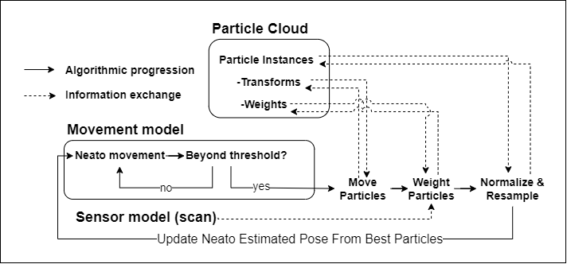
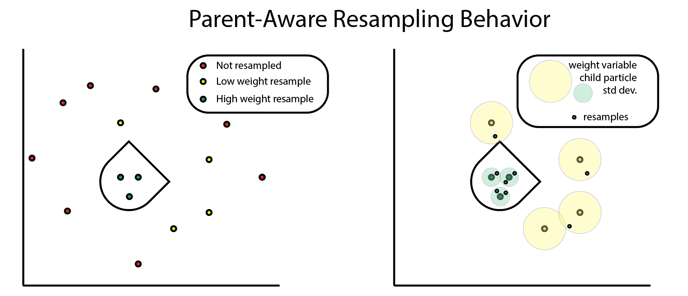
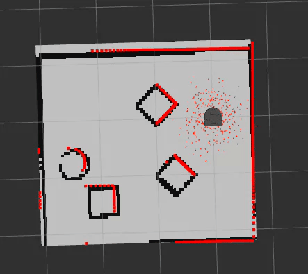
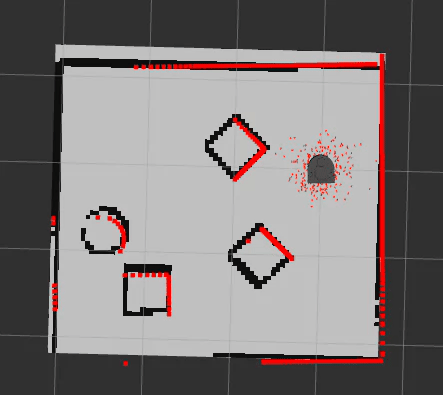

# Robot Localization Project

Team Members: Alex Matsoukas, Rajiv Perera

Course: A Computational Introduction to Robotics, Fall 2023

Professor: Paul Ruvolo

### What was the goal of your project?

Robot localization is the field of robotics that uses sensor measurements and environment information to place a robot within a known or unknown field with a reasonable degree of certainty. The goal of this project was to implement the particle-filter approach to robot localization on the Neato robotic vacuum platform bots in ROS by using lidar-scanning data in combination with a known occupancy-field-based map to locate the robot in space.

A particle filter is an algorithm in robotics which typically initializes particles representing a simulated robot within a known map. It then compares their simulated sensor values to the robot’s actual sensor values to remove poorly matching points and place new points on top of well matching points, while moving each point in accordance with its pose and the robot movement data. Through this continual moving of points and resampling, the poorly fitting particles are removed and through repopulation of well fitting particles the highest weighted particles ideally approach the true position of the robot.

### How did you solve the problem?

We solved this problem by implementing 5 main steps shared by almost all particle filter algorithms. In order, they are:

First: create your particles. This is a step outside the loop, as it is done once.

Loop Operations:

- Move particles with odometry data
- Update particle weights with sensor data (in our case, lidar scans)
- Normalize particle weights so that they sum to 1 for comparison
- Remove and Resample poorly fitting particles
- Locate the robot based on particle weights

<figure
    style=
        "display: block;
        margin-left: auto;
        margin-right: auto;
        width:60%;"
>
    
</figure>

**Finer Points of our Implementation**

Movement Management: First, we created each particle with its own orientation and position, and thus its own internal reference frame. After each particle’s reference frame was recorded, we then applied neato motion within this reference frame to reach the particle’s final position after a movement was applied. The neato motion is calculated by expressing its odom position at the new time step in neato’s reference frame from the previous time step. Finally, so that we could compare particles to each other and to the robot we converted the final post-movement particle’s frame back into the map frame.

Updating particles with lidar scans: For every particle in the particle cloud, we apply the transformation from the particle frame to the map frame on the lidar data, and then check whether each point on the newly transformed scan lies within a threshold of a real obstacle. Because the true scan would be located on the transform true to the robot, the values of a scan that was coincident with the robot position would all line up with actual map points, would return many points within the threshold, and as a result be weighted highly.

Normalizing particle weights: For the sorting and resampling methods we chose, it was necessary that all of the particle weights would sum to 1. After re-weighting the particles in accordance with the laser scans, we summed up the total weight of the particles and then divided each particle’s weight by the sum of all weight so that it was now represented as a fraction of the overall weight.

Resampling Particles: We establish a percentile (we chose 60) of particles to keep, and then applied this threshold to a weight-sorted list of our particles. After removing the bottom percentile, we re-populated those particles around the surviving particles. We used a random sample with probabilities influenced by the weights of our surviving points to create a list of parents for the new particles which drew from these survivors. From these parent particles, we allow for the new particle’s standard deviations for the random sampling of position and orientation to be high in cases of low parent particle weight and low for cases of high parent particle weight.

<figure
    style=
        "display: block;
        margin-left: auto;
        margin-right: auto;
        width:600;
        height:400"
>
    
</figure>

Locate robot: A couple of different options were explored for this feature. Initially, we wanted to explore clustering in the case that particles did not converge well, but this turned out to be very computationally expensive; due to good particle clustering upfront, we decided to choose the mean particle position. This has limitations in more symmetric environments, but worked very well in the gauntlet and MAC.

### Describe a design decision you had to make when working on your project and what you ultimately did (and why)?

Because we decided to build off of the starter code, and the overall structure of the algorithm was generally fixed, many of our design decisions came down to optimizations of our algorithm’s efficiency and effectiveness.

A big part of where the particle filter slows down is in calculating weights for each particle after every resample. This is because, at a high level, each of the 360 lidar data points need to be evaluated for each particle. For our first pass through this algorithm this was implemented as a nested `for` loop that iterated through each particle and evaluated each data point one at a time, keeping track of a cumulative total; included in this was a transformation from polar to cartesian for each individual data point. This slowed our algorithm down so much that we needed to reduce the number of particles to less than 50 in order for it to run without significant lag. The outer `for` loop can not be avoided, as each particle has a unique reference frame; however, the evaluation of the lidar data was improved by transforming and evaluating the points all at once using matrix operations. Furthermore, we found that the simple approach of counting the number of lidar points whose distance from the map was below some acceptable threshold value was a sufficient and low-cost way to assign an overall weight to the particle, which removed the need to set up a gaussian function and apply it to all the data points.

A place where we had the opportunity to pursue modifications to the algorithm to increase its effectiveness was during the resampling step. Specifically, we wanted to have the resample radius for each of the good seed particles to be variable, dependent on its weight, or confidence. Our final design decision was to decrease the standard deviation of resampled particles around a given seed particle exponentially as the weight of the seed particle increases. This has the effect of gradually converging the particles around one final point; see the comparison below for the difference between when resample radius is constant (left) and when the resampled particles “know” the confidence of their seed particle (right).

<figure
  style=
    "display: flex;"
>
  

    
  

  

    
  

</figure>

During the initial scoping of this project, we decided that we wanted to engage in this code work in a more rigidly managed structure than is typically required in a two person project. We used github’s native issue and branch management tools to submit pull requests for each new code expansion, conducted code reviews before merging any code to the main branch, and used issues to control the scope and direction of our development. Although this structure seems cumbersome, it actually massively sped up development time because it provided a scaffolded, non-personal, and automatic structure to justify the many design decisions that we were faced with within the codebase itself. This also allowed us to easily see where we were going at any point in the development cycle, and track ourselves in relation to our overall goals to reduce or increase our scope when necessary. The most unexpected benefit of this design decision was that it was massively beneficial when we were reduced to one working linux install between the two of us.

### What if any challenges did you face along the way?

Early on, the largest challenge we faced was getting integrated into the starter code. We made sure that we spent some time to fully understand the flow of code in the particle filter node, as there were many helper functions that complicated the control structure. We found that the best was to understand how the code works was to implement a very quick pass through each of the missing components in the starter repository, and go back and refactor, optimize, and scale up once the behavior of the particles was as expected.

As we got deeper into the implementation, another challenge was balancing what would be most effective and what is necessary and computationally efficient. A great example of this is when we tried to implement the method that picks the robot’s location, given the placement and weights of the particles. We thought it would be interesting to implement a clustering algorithm that groups the particles and returns the sizes and centroids of the clusters; this could be used if the particle filter ends up splitting into clusters instead of converging. It turns out that this was extremely computationally expensive, and we noticed that the particles were actually converging decently well, even right at the beginning; therefore, we decided a simpler and equally effective approach would be to use the mean particle pose as the robot’s pose.

As mentioned previously, one of our linux installs was lost two days into the project. Luckily, the structure which we had chosen early on into the project lended itself to discretizing development chunks that could be reviewed before implementation. As a result, even though there was no way for Rajiv to test his code, he was still able to participate by building functionality in branches that would go to Alex for review before their merge. Though github and exception handling in tandem with thorough f-string print statement, Rajiv was still able to participate actively in development. Lastly, because this structure lended itself to frequent recalibrating discussions to create new issues and blaze the path forward in development, that soft-skills and management portion of the project was unaffected by access to linux and was of large emphasis and utility to the project flow.

### What would you do to improve your project if you had more time?

We have a couple of areas of interest that we’d like to pursue if we had more time to improve the project. The first one would be to take on a more challenging variation of this problem, such as the robot kidnapping problem, in which the robot can be picked up and relocated at any time. Some of our assumptions and algorithmic approaches that worked for our project would not work for the robot kidnapping problem, which would require us to make the particle filter more robust. For example, while we can still update particles with the robot’s odometry, it wouldn’t make much sense if all of the particles are on the opposite side of the map from the robot after it has been kidnapped, and resampling around those particles would continue to yield bad results. Therefore, we would need to figure out a way to reseed particles across the entire map if we sense that the robot has been kidnapped.

Additionally, we would like to look into and experiment with different weighting algorithms and make direct comparisons between them. By running different algorithms on the same bag file as a baseline, we can compare how different weighting algorithms affect how quickly the particles located the robot. Since we used a very simple weighting algorithm, described above, it would be interesting to see if something more complicated, such as assigning weights based on a gaussian curve, actually results in better performance.

### Did you learn any interesting lessons for future robotic programming projects?

For this project, we decided to work with GitHub issues; this was our first time using this structure on an Olin project, and we both found it to be very helpful in tracking the flow of work over the course of the project. Each issue can be tied to its own development branch, which once merged into the main branch, closes the issue; in this way, the work is easily divisible. Furthermore, the pull request structure that is built into GitHub makes it easy to review code and suggest changes.

We also found that using the starter code still allowed us to pursue areas that we were each individually excited about. When scoping and breaking down the project at the start, we were worried that the starter code would be too constrictive and not allow us to make modifications to the algorithm; however, after doing an initial pass to get the particle filter working as an MVP, we had some time to explore algorithm improvements beyond the scope of what was in the starter code.

Finally, a key takeaway from this project is that it is important to scope future robotic programming projects appropriately. Because our development time was impacted by only having one ros environment for the majority of the project, we would have had a much harder time with an overscoped project. We were able to mitigate this largely through good team communication, clear delegation of work, and a good idea of how to break down the project early on.
